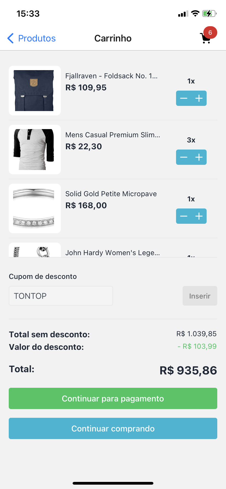
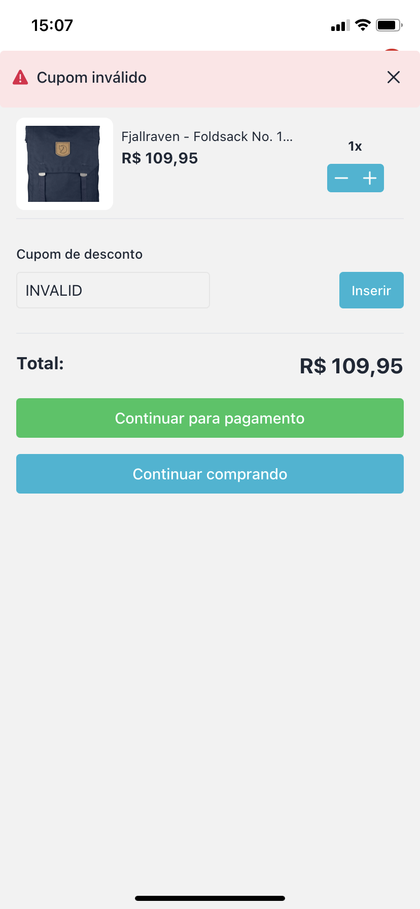
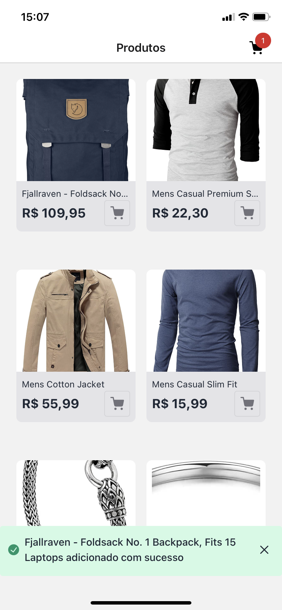
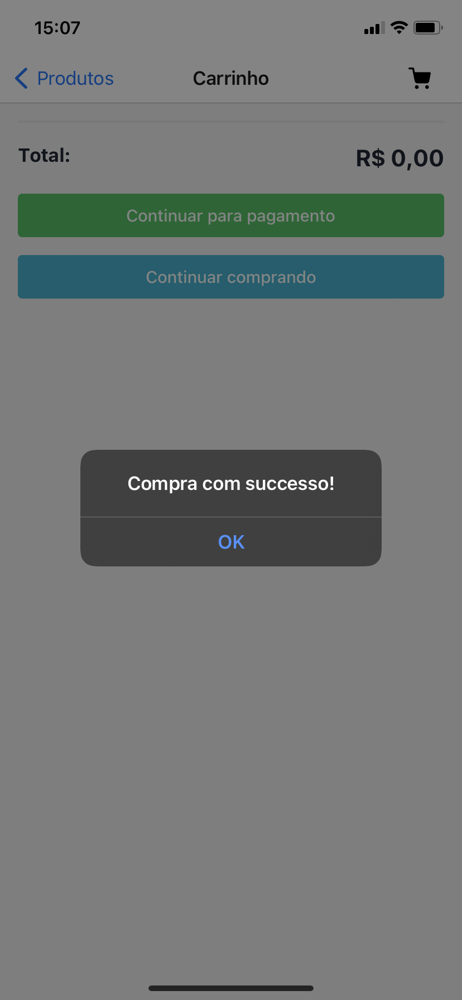
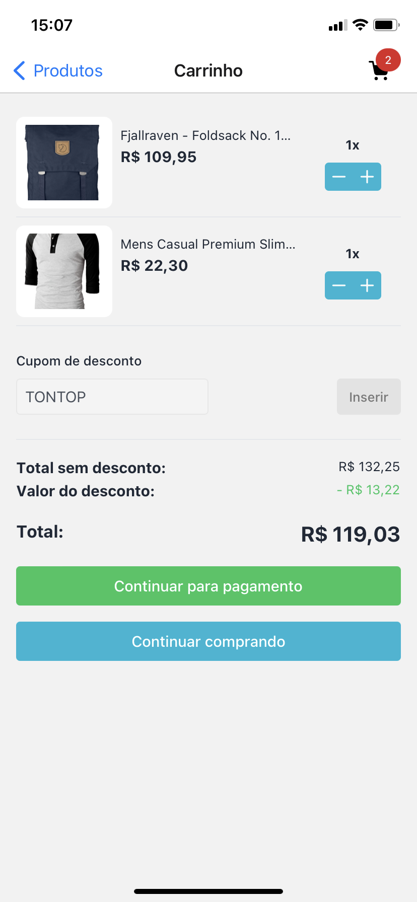
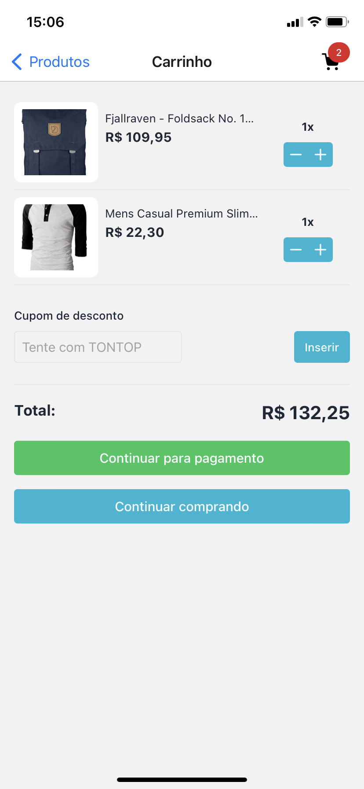

# TonChallenge

O desafio foi feito utilizando as tecnologias: React Native + Typescript + Expo.
Para a busca de produtos, foi utilizado a API [**Fakestore**](https://fakestoreapi.com/).

## Screenshots

## Funcionalidades

- [x] O usuário consegue ver os produtos
- [x] O usuário consegue adicionar produtos ao carrinho
- [x] O usuário consegue remover produtos do carrinho
- [x] O usuário consegue ver o valor total do carrinho
- [x] O usuário consegue aplicar cupom de desconto (TONTOP)
- [x] O usuário consegue ver mais detalhes do produto clicando nele
- [x] O usuário consegue recarregar a tela de produtos arrastando para baixo

## Recursos

**A APK está na pasta "app" com o nome "TonChallenge.apk"**
